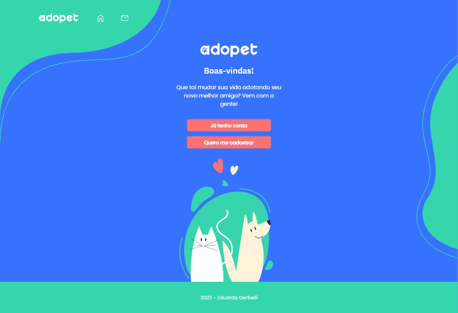

# Adopet - Alura Challenge

This is a solution to the [Adopet Alura Challenge Front-end](https://www.alura.com.br/)

## Table of contents

- [Overview](#overview)
  - [The challenge](#the-challenge)
  - [Screenshot](#screenshot)
  - [Links](#links)
- [My process](#my-process)
  - [Built with](#built-with)
  - [What I learned](#what-i-learned)
  - [Useful resources](#useful-resources)
- [Author](#author)

## Overview

### The challenge

Users should be able to:

- View the optimal layout for each page depending on their device's screen size
- See hover states for all interactive elements on the page
- Register and interact

### Screenshot

### Links

- Solution URL: [Add solution URL here](https://github.com/gerbelli27/adopet)
- Live Site URL: [Add live site URL here](http://adopet.x10.mx/)

## My process

### Built with

- Semantic HTML5 markup
- CSS Modules custom properties
- Flexbox
- React JS
- Mobile-first workflow
- Wordpress Rest API back-end

### What I learned

In this project I learned how to make a React application from scratch following strict instructions from designer to achieve pixel perfect layout fully functional connected with backend.

### Useful resources

https://stackoverflow.com/ |
https://www.alura.com.br |
https://www.origamid.com |

## Author

- Website - [Eduardo Gerbelli](https://www.linkedin.com/in/eduardogerbelli/)
- Github - [gerbelli27](https://github.com/gerbelli27)
